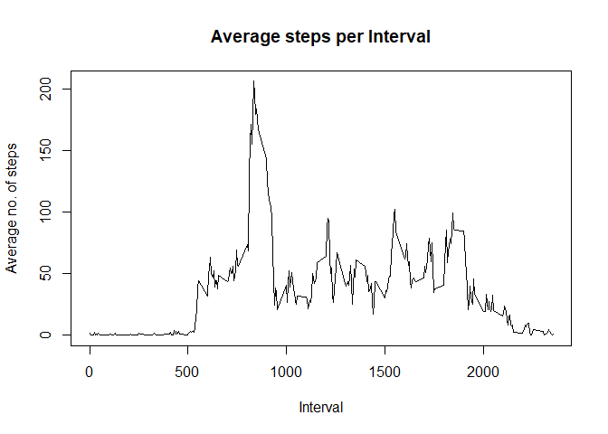
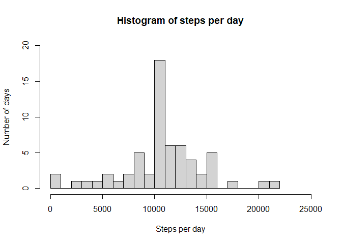
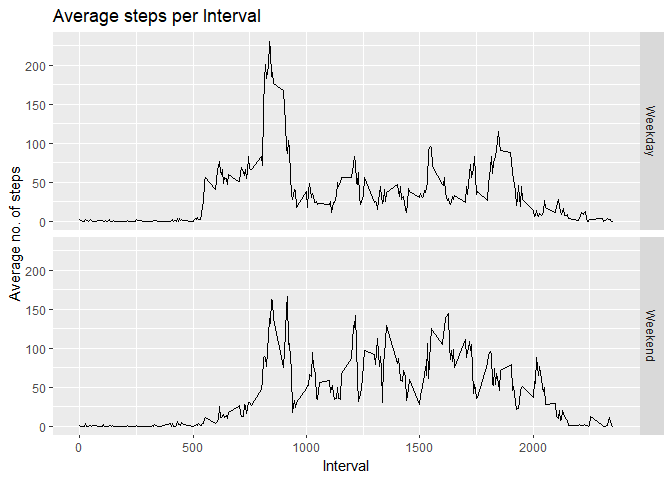

## Loading and preprocessing the data
- Code for reading in the dataset and/or processing the data
Packages "lubridate"  and "dplyr" are useful in analysing data related to dates and data frames, respectively. Some figures were plotted in ggplot2 plotting system. 


```r
library(dplyr)
library(lubridate)
library(ggplot2)
setwd("~/Online_Courses/Data Analysis R Foundations/Reproducible research/Project 1/RepData_PeerAssessment1")
data <- read.table(unz("activity.zip", "activity.csv"), sep=",", header = TRUE)
data$date <- as.Date(data$date)
```

Next, we perform data analysis as per the assignment's instructions. 


## What is mean total number of steps taken per day?

### 1. Histogram of the total number of steps taken each day
- In the first step, the data of having "NA" are removed and the remaining data is stored in "data_good".
- Sum of steps for each date was calculated by grouping data by dates. 

```r
data_good <- subset(data, !is.na(steps))
step_day <- data_good %>% group_by(date) %>% summarize(stepsperday = sum(steps))
with(step_day, hist(stepsperday, breaks = 50, 
                     xlim = c(0, 25000), ylim = c(0, 12),
                    xlab = "Steps per day", ylab = "Frequency - Number of days", 
                    main = "Histogram of steps per day"))
```


### 2. Mean and median of steps taken each day

```r
mean <- mean(step_day$stepsperday)
median <- median(step_day$stepsperday)
```
The **mean and median** of total steps taken per day are **10766.19** and **10765**, respectively.


## What is the average daily activity pattern?

### 1. Time-series plot of 5-minute interval and average number of steps in each interval \

- First, the data is grouped according to intervals and subsequently, average of steps of each interval were calculated. Thus obtained, "step_pattern" has data of interval and average steps.
<!-- - In the next step, intervals were converted into time series by using function strptime. -->
- In the last step, the average steps of intervals were plotted as a function of the interval.  


```r
step_pattern <- data_good %>% group_by(interval) %>% summarize(stepsperinterval = mean(steps))
with(step_pattern, plot(interval, stepsperinterval, type = 'l', 
                        xlab = "Interval", ylab = "Average no. of steps", 
                        main = "Average steps per Interval"))
```



### 2. Determination the interval of the maximum no. of average steps per interval 
- First, the index of maximum no. of average step per interval was extracted and then, the interval value was determined. 

```r
max_interval <- step_pattern$interval[which.max(step_pattern$stepsperinterval)]
```
The interval value corresponding to the maximum of average steps per interval is **835**.

## Imputing missing values
### 1. Total number of missing values

```r
na_sum <- sum(is.na(data))
```
The total number of missing rows are **2304**.

### 2. Create a new data set with missing values
- We filled the missing values by the mean for that 5-minute interval in the following steps.
- A new dataset "data2" was created with the same values as of "data".
- The indecies of "NA" rows were extracted as the steps of these rows needs to be imputed.
- Values were replaced from the previously created dataset "step_pattern" of mean for 5-minute interval by matching the interval values. 


```r
data2 <- data
na_index <- which(is.na(data2))
data2$stnew <- data2$steps 
na_interval <- data2$interval[na_index]
data2$stnew[na_index] <- step_pattern$stepsperinterval[sapply(na_interval, 
                        function(x){which(step_pattern$interval == x)})]
```

### 3. Histogram of total number of steps taken each day
- For the imputed data set "data2", total number of steps per day are calculated and subsequently, histogram was plotted.


```r
step_day_new <- data2 %>% group_by(date) %>% summarize(stepsperday = sum(stnew))
with(step_day_new, hist(stepsperday, breaks = 25, xlim = c(0, 25000), ylim = c(0,20),
                    xlab = "Steps per day", ylab = "Number of days", 
                    main = "Histogram of steps per day"))
```



### Comparison of mean and median of steps per day with and without imputing values


```r
mean_new <- mean(step_day_new$stepsperday, scipen = 999)
median_new <- median(step_day_new$stepsperday)
```
The mean of steps per day with and without NA imputing remain the same as 10766.19. But, the median with and without NA imputing are different; 10766.19 and 10765, respectively.

## Are there differences in activity patterns between weekdays and weekends?
- From the given dates, weekdays were calculated. Then, they were factorized into weekday and weekend factors which are stored as type variable. 

```r
weekday <- c("Monday",  "Tuesday" ,  "Wednesday", "Thursday"  , "Friday" )
weekend <- c("Saturday", "Sunday")
data2$type <- factor(sapply(data2$date, function(x) {if(weekdays(x) %in% weekday) "Weekday" else "Weekend"}))
```


Then average number of steps per interval for weekday and weekend were calculated and plotted separately. 

```r
step_pattern_imputed <- data2   %>% group_by(interval, type) %>% 
    summarize(stepsperinterval = mean(stnew))
q <- with(step_pattern_imputed, qplot(interval, stepsperinterval, facets = type~., 
                                      xlab = "Interval",ylab = "Average no. of steps", 
                                      main = "Average steps per Interval", geom = "path"))
plot(q)
```


