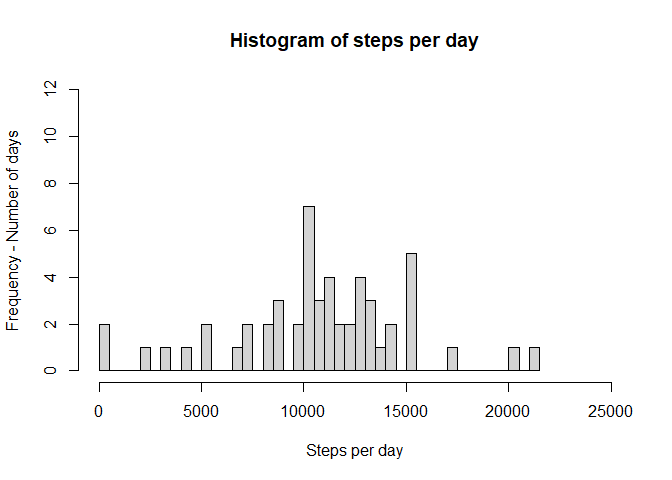

## Loading and preprocessing the data
1. Code for reading in the dataset and/or processing the data
Packages "lubridate"  and "dplyr" are useful in analysing data related to dates and data frames, respectively.


```r
library(dplyr)
library(lubridate)
setwd("~/Online_Courses/Data Analysis R Foundations/Reproducible research/Project 1/RepData_PeerAssessment1")
data <- read.table(unz("activity.zip", "activity.csv"), sep=",", header = TRUE)
data$date <- as.Date(data$date)
```

Next, we perform data analysis as per the assignment's instructions. 


## What is mean total number of steps taken per day?
2. Histogram of the total number of steps taken each day


```r
step_day <- data %>% group_by(date) %>% summarize(stepsperday = sum(steps, na.rm = TRUE))
with(step_day, hist(stepsperday, breaks = 50, xlab = "Steps per day", ylab = "Frequency - Number of days", main = "Histogram of steps per day"))
```



3. Mean and median of steps taken each day

```r
mean <- mean(step_day$stepsperday)
median <- median(step_day$stepsperday)
```
The mean and median of total steps taken per day are **9354.23** and **10395**, respectively.


## What is the average daily activity pattern?


## Imputing missing values


## Are there differences in activity patterns between weekdays and weekends?
